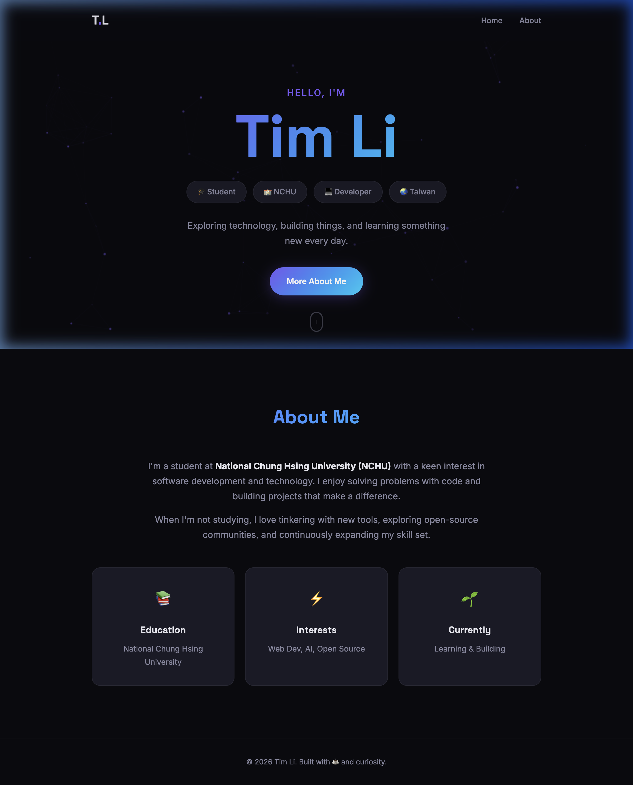

# Personal Website — Tim Li

## Overview
A modern, premium personal webpage for **Tim Li**, built with pure HTML, CSS, and JavaScript. The site features a sleek dark theme with animated particle backgrounds, glassmorphism effects, responsive web design (RWD), and smooth scroll-reveal animations.

**Live Demo:** [https://timjack8223812-stack.github.io/personal-website/](https://timjack8223812-stack.github.io/personal-website/)

## Completed Tasks

### 1. Web Development
- **Main Interface (`index.html`)**: Built a responsive single-page layout featuring a dynamic hero section with identity tags (Student, NCHU, Developer, Taiwan) and an About section with info cards.
- **Styling (`style.css`)**: Implemented a dark-themed design system with CSS variables, purple-to-cyan gradient accents, glassmorphism navigation bar, and micro-animations for a premium feel.
- **Interactivity (`script.js`)**: Added an animated particle constellation background, scroll-triggered reveal animations, and smooth-scroll navigation.
- **Responsive Web Design (RWD)**: Implemented 4 breakpoints (1024px, 768px, 480px, 360px) to ensure a seamless experience across desktop, tablet, and mobile devices.

### 2. Git & GitHub Integration
- **Local Initialization**: Initialized a new Git repository in the project directory.
- **SSH Configuration**: Generated an ED25519 SSH key and linked it to the GitHub account for secure authentication.
- **Successful Deployment**: Pushed the codebase to the remote repository: [https://github.com/timjack8223812-stack/personal-website](https://github.com/timjack8223812-stack/personal-website).

## File Structure
- `index.html` — Core page structure and content
- `style.css` — Visual design, layout, and responsive breakpoints
- `script.js` — Particle background and interactive features
- `README.md` — This project documentation

## Features
- 🌑 Dark theme with purple-to-cyan gradient accents
- ✨ Animated particle constellation background
- 🪟 Glassmorphism frosted navigation bar
- 📱 Fully responsive (RWD) — desktop, tablet, and mobile
- 🎞️ Scroll-reveal and hover micro-animations
- 🏷️ Identity tags (Student, NCHU, Developer, Taiwan)

## Responsive Breakpoints
| Breakpoint | Target Device |
|------------|---------------|
| > 1024px | Desktop |
| ≤ 1024px | Tablet Landscape |
| ≤ 768px | Tablet Portrait |
| ≤ 480px | Mobile |
| ≤ 360px | Small Mobile |

## Future Recommendations
- Enable GitHub Pages for public hosting
- Add more personal project showcases
- Add a blog or recent activity section
